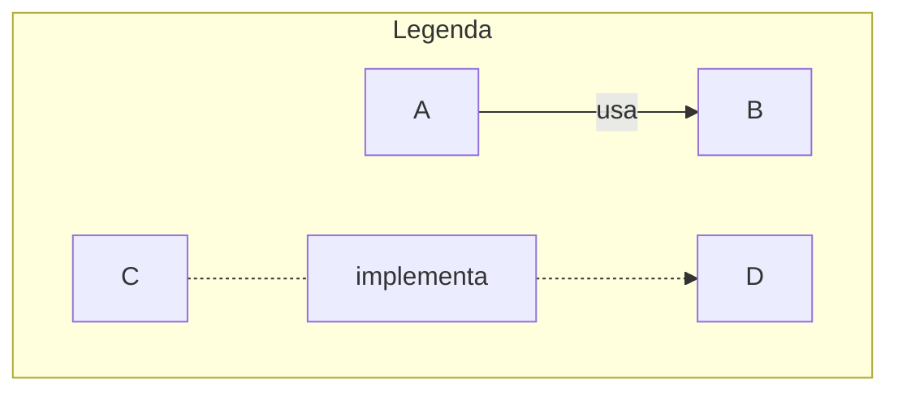
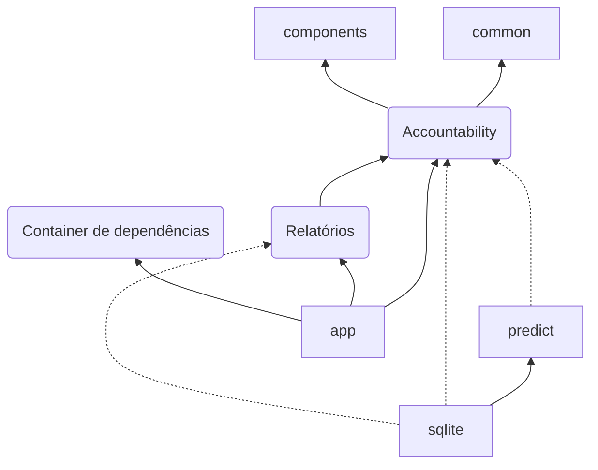

Organização do projeto

- app: aplicação
- docs: documentação
- predict: serviço de predição

# App

A aplicação principal do Biluca Finanças. Desenvolvido em [Flutter](https://github.com/BrunoBiluca/biluca-knowledge/tree/main/Frontend/Flutter).

Módulos

accountability
common
components
predict
reports
sqlite
app
cd